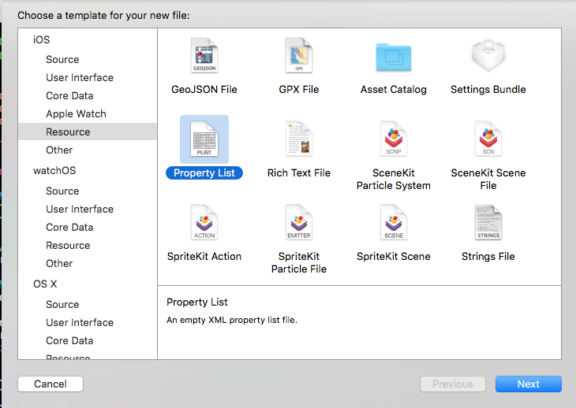
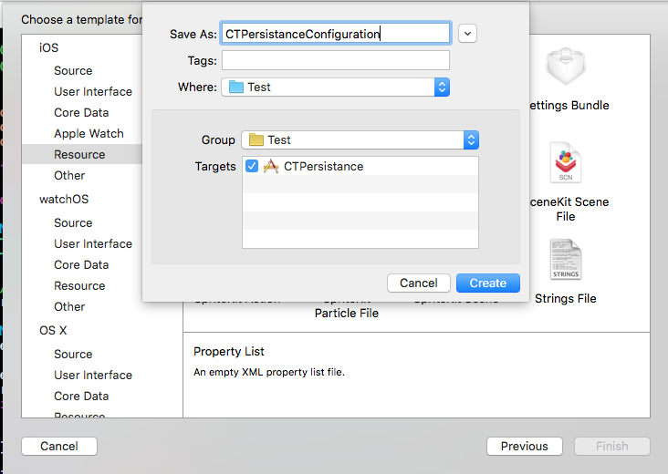
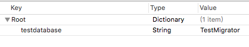

Persistence, Persistance, lol.

2016-05-10: I'm still maintaining this pod~ Welcome issues and PRs, and I'm glad to hear you are using this pod in your project.

define the marco `CTPersistanceShowSQLLog` to show SQL log.

#CTPersistance

`CTPersistance` can be used as a `Model Layer` in iOS App development, maybe can used for MacOSX develop, but I'm not tested yet. See [CTPersistance Reference](http://persistance.casatwy.com) for more infomation.

### Notice

Any object who conforms to `<CTPersistanceRecordProtocol>` can be a record and can be accepted by `CTPersistance`, even your customized UIView. see [issue 21](https://github.com/casatwy/CTPersistance/issues/21)

#Install (CocoaPods)

`pod 'CTPersistance'`

#Features

1. Insert, Delete, Update, Read
2. support database migration
3. transaction
4. multi-thread
5. use SQL directly with CTPersistanceTable instance

# Prerequisition

go to `Build Phases` and add `sqlite3` into your library list.

#Quick Try (Insert, Delete, Update, Read)

### 1. create `TestRecord` which extends from `CTPersistanceRecord`, and add the column property:

##### Notice: Any object who conforms to `<CTPersistanceRecordProtocol>` can be a record and can be accepted by `CTPersistance`, even your customized UIView. see [issue 21](https://github.com/casatwy/CTPersistance/issues/21). Thus, you can handle any type of object with this protocol. In this demo we extends `CTPersistanceRecord` for convenience.

```
@interface TestRecord : CTPersistanceRecord

@property (nonatomic, copy) NSNumber *identifier;
@property (nonatomic, copy) NSString *text;

@end
```

### 2. create `TestTable` which extends from `CTPersistanceTable`, and conforms to `CTPersistanceTableProtocol` like this:
```
#import "CTPersistance.h"

@interface TestTable : CTPersistanceTable <CTPersistanceTableProtocol>

@end

```

### 3. implement <CTPersistanceTableProtocol> in your `TestTable`
```
@implementation TestTable

#pragma mark - CTPersistanceTableProtocol
- (NSString *)databaseName
{
    return @"TestDataBase.sqlite";
}

- (NSString *)tableName
{
    return @"TestTable";
}

- (NSDictionary *)columnInfo
{
    return @{
             @"identifier":@"INTEGER PRIMARY KEY AUTOINCREMENT",
             @"text":@"TEXT"
             };
}

- (Class)recordClass
{
    return [TestRecord class];
}

- (NSString *)primaryKeyName
{
    return @"identifier";
}

@end
```

### 4. Ta Da.. let's play. `CTPersistance` will create database and table for you.

```
#import "ViewController.h"

#import "TestTable.h"
#import "TestRecord.h"

@interface ViewController ()

@end

@implementation ViewController

- (void)viewDidLoad {
    [super viewDidLoad];
    
    /* insert */
    NSError *error = nil;
    TestTable *table = [[TestTable alloc] init];
    TestRecord *record = [[TestRecord alloc] init];
    record.text = @"hello, world!";
    [table insertRecord:record error:&error];
    NSLog(@"%@", record.identifier); // 1
    
    /* read */
    record = (TestRecord *)[table findLatestRecordWithError:&error];
    NSLog(@"%@", record.text); // hello, world!
    
    /* update */
    record = (TestRecord *)[table findWithPrimaryKey:@(1) error:&error];
    record.text = @"hello, universe!";
    [table updateRecord:record error:&error];
    
    /* delete */
    [table deleteRecord:record error:&error];
}

@end
```

#Quick Try (Migration)

NOTICE:

you can `only` use **CTPersistanceQueryCommand** to do your migration job, and `DO NOT` use **CTPersistanceTable**

### 1. create migration step object which confirm to `<CTPersistanceMigrationStep>`

```
#import <Foundation/Foundation.h>
#import "CTPersistanceMigrator.h"

@interface MigrationStep1_0 : NSObject <CTPersistanceMigrationStep>

@end
```

### 2. implement the methods in `<CTPersistanceMigrationStep>`

NOTICE:

you can `only` use **CTPersistanceQueryCommand** to do your migration job, and `DO NOT` use **CTPersistanceTable**

```
#import "MigrationStep1_0.h"

#import "TestTable.h"

@implementation MigrationStep1_0

- (void)goUpWithQueryCommand:(CTPersistanceQueryCommand *)queryCommand error:(NSError *__autoreleasing *)error
{
    [queryCommand dropTable:@"user"];
}

- (void)goDownWithQueryCommand:(CTPersistanceQueryCommand *)queryCommand error:(NSError *__autoreleasing *)error
{
    // do nothing
}

@end
```

### 3. create the migrator which extends from `CTPersistanceMigrator` and confirm to `<CTPersistanceMigratorProtocol>`

```
#import "CTPersistanceMigrator.h"

@interface TestMigrator : CTPersistanceMigrator <CTPersistanceMigratorProtocol>

@end
```

### 4. implement `CTPersistanceMigratorProtocol`

import the step object you just created, and put them into `migrationStepDictionary`, `migrationVersionList` is the order to migrate steps, the version list must start with `kCTPersistanceInitVersion`.

```
#import "TestMigrator.h"

#import "CTPersistanceConfiguration.h"

#import "MigrationStep1_0.h"
#import "MigrationStep2_0.h"

@implementation TestMigrator

#pragma mark - CTPersistanceMigratorProtocol
- (NSDictionary *)migrationStepDictionary
{
    return @{
             @"1.0":[MigrationStep1_0 class],
             @"2.0":[MigrationStep2_0 class]
             };
}

- (NSArray *)migrationVersionList
{
    return @[kCTPersistanceInitVersion, @"1.0", @"2.0"];
}
```

### 5. Create a new plist file named `CTPersistanceConfiguration` in your bundle




### 6. add a record in plist

the key is the name of the database which you want to migrate.
the value is the name of the class name of the migrator.

`CTPersistance` will try to match the key with the name of database to decide which migrator to use, and you can use Regular Express Patten for the key.



### Done!

you can try migration now!

# Quick Try (Transaction)

```

TestTable *testTable = [[TestTable alloc] init];
[CTPersistanceTransaction performTranscationWithBlock:^(BOOL *shouldRollback) {

        NSUInteger count = 10000;
        while (count --> 0) {
            TestRecord *record = [[TestRecord alloc] init];
            record.age = @(count);
            record.name = @"casa";
            record.tomas = @"casa";
            [testTable insertRecord:record error:NULL];
        }

        *shouldRollback = NO;

    } queryCommand:testTable.queryCommand lockType:CTPersistanceTransactionLockTypeDefault];

```

# Quick Try (Multi-thread)

see also TestCaseAsync.m

NOTICE: You should always create a new table in the async block.

```
    [[CTPersistanceAsyncExecutor sharedInstance] performAsyncAction:^{
        NSUInteger count = 500;
        NSError *error = nil;

        // always create table which you want to manipulate data in asyn block!!!
        TestTable *testTable = [[TestTable alloc] init];

        while (count --> 0) {
            TestRecord *record = [[TestRecord alloc] init];
            record.age = @(count);
            record.name = @"name";
            record.tomas = @"tomas";
            [testTable insertRecord:record error:&error];
            if (error) {
                NSLog(@"error is %@", error);
                NSException *exception = [[NSException alloc] init];
                @throw exception;
            }
        }
    } shouldWaitUntilDone:NO];
```
